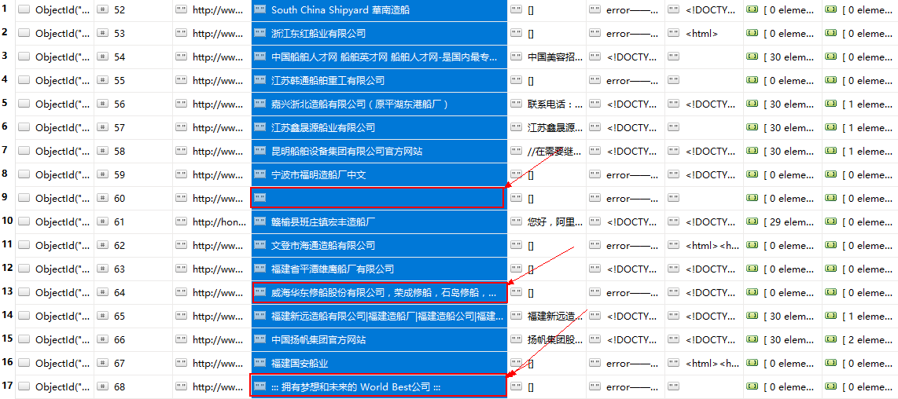
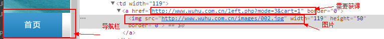
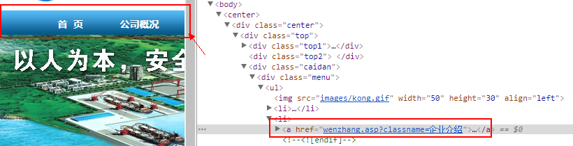
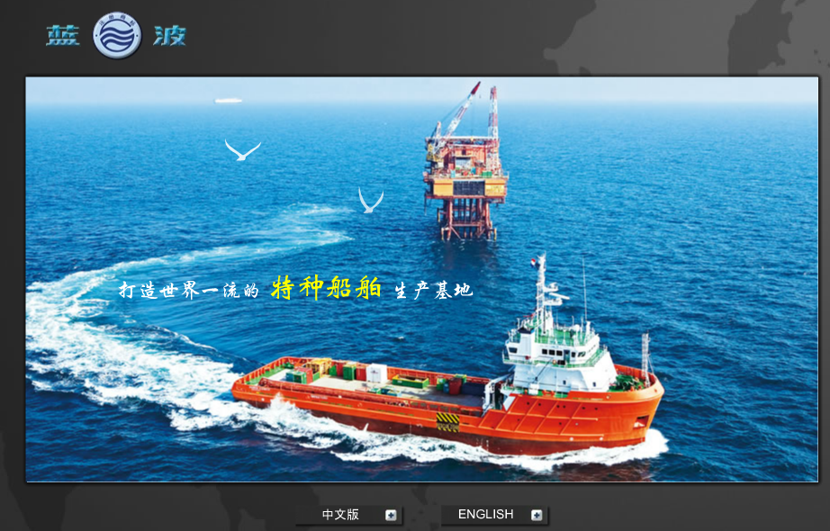

# 标题：百度获取关键词URL并获取官网的‘公司简介’

>Data:2017-9-12

>Author:zf

## 版本V1：（bug简说）
##### 1.获取官网时进入百度翻页到达10页以上会出现与造船不相关信息（如：学校）

    描述：如下图红色框中所显示，搜索页数过多将出现于搜索词不想管内容。（随着数量的增减，错误率将增大！）
    
   
   
   如：[芜湖造船厂有限公司](http://www.wuhu.com.cn/)
    
解决方案：暂无解决

##### 2.进入官网时会有网页正在维护中的情况

    描述：如图所示，有些官网正在维护，导致此次运行系统将会把此逛网记为“error”。
   
    
解决方案：暂无解决（可自动报错跳过“error”）

#####3.在获取关于“公司简介”等相关语义的“url”时，遇到以下问题：

###### 3.1.公司主页面没有“公司简介”等相关语义的四个字

     描述：本服务为查找网页关键词，从而获得关键词之前的链接，进而进去公司简介中获取详细信息。所以若网页中没有相关“公司简介”语义的词汇时，将找不到相关的链接。
如：[江苏韩通船舶重工有限公司](http://www.cnhtship.com/)     

###### 解决方案：暂无解决

######3.2.公司主页面上相关“公司简介”语义的导航栏为图片所做，暂不能提取文字

     描述：有些公司官网导航栏为图片直接挂上去的，不是<div>标签拼成的，所以暂时找不到关键词及链接。 
   
     
######解决方案：商议在第二版用上图片识别功能

######3.3.公司主页面上“公司简介”等相关语义url编码问题

     描述：一些官网的导航栏的url如下图，有中文字符，当浏览器打开时需要知道它的编码方式才能打开此链接。
   
   
   如：[中航威海船厂有限公司](http://www.wh-shipyard.com/)
######解决方案：暂无解决

######3.4.进入公司主页面不是正常主页面情况

     描述:如图所示,进入官网链接后不是正常的主页面,而是一个动画或者一个选择标签.
   
   
   如：[江苏省镇江船厂集团欢迎您](http://www.zjshipyard.com/)
######解决方案：暂无解决

######3.5.公司主页面没有“公司简介”等相关语义的四个字

     描述
     
######解决方案：暂无解决


##功能描述
此项目主要实现如下几点：
 - 1.通过输入的关键字进入百度查找并获得网址链接
 - 2.通过判断获得的url，获得关于关键词的所有官网
 - 3.进入官网查找官网页面上有关“公司简介”相关语义的词汇的链接（一般在导航栏上）
 - 4.进入找到的链接并获取里面的长篇带“。”的段落文字


# HDFS CRUD 微服务操作接口

# API Server

`http://172.25.254.11:5000`

# 日志

在对 HDFS 进行增，删，上传等会改变数据的操作时，自动生成日志，记录下数据所发生的变化

>注：本功能基于 MariaDB 接口，必须确保可以访问该接口

`POST`: `无`

>注：因为此功能为自动功能，所以不需要用户对其操作

Data:

```json
{                                
    "action": "post",
    "table": "daily",
    "columns": [
    "address",
    "action",
    "result",
    "reason",
    "timestamp",
    "filename",
    "file_path",
    "save_path"
    ],
    "data": [
    address,
    action,
    'sucess',
    '',
    '',
    filename,
    path,
    ''
    ]                             
}
```
#### `action`
    访问 MariaDB 接口的请求方式
    
#### `table`
    数据所要存储的表
 
>注：该表必须在 MariaDB 接口所访问的数据库中已经创建完毕

#### `columns`
    请求数据的字段名
    
>注：字段名必须在上述访问的表中已经被创建，且不可随意更改
    
    
#### `data`
    日志的具体数值
         
>注：因为此功能为自动功能，所以不用手动添加任何数据

Response:

```json
此功能无返回值，只会将数据存储至数据库中
```

*附：创建表和字段名的语句*

```SQL
CREATE TABLE `daily` (
  `id`        INT(11)     AUTO_INCREMENT,
  `address`   VARCHAR(32) DEFAULT NULL,
  `action`    VARCHAR(16) DEFAULT NULL,
  `result`    VARCHAR(16) DEFAULT NULL,
  `reason`    TEXT,
  `timestamp` DATETIME    DEFAULT NULL,
  `filename`  VARCHAR(64) DEFAULT NULL,
  `file_path` VARCHAR(64) DEFAULT NULL,
  `save_path` VARCHAR(64) DEFAULT NULL,
  PRIMARY KEY (`id`)
)
```

# 查找

查找文件系统中存在的文件夹或文件

`GET`:`/search`

Data:

#### `uesr`
    操作的用户
> 注：部分文件具有权限设置，如果用户的等级不够，则可能无法对其进行查找

#### `path`
    所要查找的路径
> 注：当输入文件名时，若有同名文件或者文件夹，都会被查找到

查找路径：

```json
{
	'user':'hdfs',
	'path':'/fdata'
 }
```

查找文件名：

```json
{
	'user':'hdfs',
	'path':'test'
 }
```


Response:

查找路径：

```json
{
	"data",
	"second.txt"
}
```


查找文件：

```json
{
	"1": [
	"This is a folder",
	"path=/predictData"
	],
	"2": [
	"This is a folder",
	"path=/user/zeppelin"
	]
}
```


# 查询

查询某个数据文件中的数据

>注：文件类型有较大限制，仅限 csv 或 csv 格式的文件

`GET`:`/select`

Data:

#### `file`
	所要查询的文件的位置
	
>注：端口号不用填写，例如：172.25.254.11:5000，其中:5000不用填写

#### `colunm`
	所要查询的字段名,若要查询多个，输入示例为：'id,name',注意逗号为英文输入法下的逗号

#### `math`
	所要查找的数据的行数（可为空）

#### `ordercolunm`
	数据排列顺序所依据的字段（可为空）

```json
{
	'file': '172.25.254.11/fdata/second.txt',
	'column': 'id,name',
	'math': '2',
	'ordercolumn': 'id'
}
```

Response:

#### `Row`
    所要查询的一条数据
    

#### `id`，`name`
    所要查询数据的具体字段

```json
{
    Row(id='1', name='a'), 
    Row(id='2', name='s')
}
```


# 删除

删除 HDFS 文件

`POST`: `/hdfs/delete`

Data:

#### `path`
    后面添加完整的路径名，比如删除文件 fdata 里的文件 test.txt ，写的形式为 /fdata/test.txt


```json
{	
    "path":/fdata/test
}
```
  
Response:

```json
{
    True
}
```
>注：若删除失败则显示Flase
    
# 新建

新建HDFS文件夹

`POST`: `/hdfs/makedirs`

Data:

#### `path`
    新建文件夹位置，必须以 ‘/’ 结尾，比如在 fdata 文件夹下新建文件夹，写的形式为 /fdata/


#### `code`
    新建文件夹名称，只需要填写名称即可，不用添加 ‘/’ ，比如 test

```json
{
    'path':'/fdata/',
    'code':'aaa'
}
```

Response:

```json
{
   'file already exist'
}
```

>注：若创建成功，则显示创建的文件夹名


# 上传

上传文件到 HDFS ,如果有同名文件，旧的文件将会被新的文件所替换

`POST：/hdfs/upload`

Data:

#### `code`
    保存上传数据的文件夹


#### `path`
    保存上传数据的文件夹的上一级目录

```json
{
    "path": fdata/
    "code": test
}
```

Response:

#### `token`
    文件上传位置
#### `saved count`
    上传成功个数
#### `fail count`
    上传失败个数

```json
{
    "fail count": 1,
    "saved count": 1,
    "token": "8y月26日"
}
```


    
